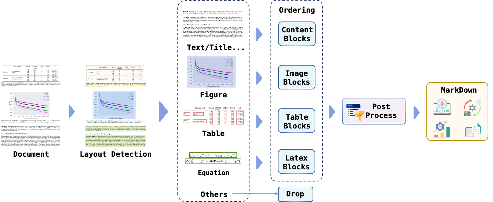

# document-convert

## Introduction
A great deal of high-quality LLM pre-training data exists in the form of PDFs or scanned images. Due to the diversity in layout and format along with the inconsistent quality of scanned images, building datasets from these data is a challenging task; it requires the conversion of these contents into a markdown-like format for usability. The core issues focus on two aspects: By analyzing the layout information (including text, titles, captions, images, tables, and formulas), different elements are identified and the relationships among these layout components are handled.

We have observed several excellent open-source solutions, such as PP-StructureV2, Marker, Vary, and Nougat, each with areas deserving improvement. PP-StructureV2 lacks the ability to recognize LaTeX format content; Marker supports fewer languages and does not process figures effectively; Nougat has limited support for multi-column data; Vary, Vary-toy require considerable computational resources. Therefore, we have integrated the strengths of these models and proposed an efficient transformation Pipeline.



## Installation

To install the required packages and set up the environment, run the following commands:

```shell
pip install -r requirements.txt
```
Then, install [fastdeploy](https://github.com/PaddlePaddle/FastDeploy)
```shell
python -m pip install fastdeploy-gpu-python -f https://www.paddlepaddle.org.cn/whl/fastdeploy.html
```

## Usage
To convert a PDF to a document format, execute the following command:

```python
python multi_thread_process_to_doc.py <pdf-path> --process-num 8 
```
This command processes the PDF located at <pdf-path> using multi-threaded operations to expedite the conversion process.
Our uses the multithreading feature of fastdeploy. If a GPU OOM (Out of Memory) error occurs, you may consider suitably decreasing the <process-num>.

If you wish to visualize the results of the layout detection, you can use the --visualize-layout parameter
```python
python multi_thread_process_to_doc.py <pdf-path> --process-num 8 --visualize-layout
```

We will support the use of qwen-long as soon as possible to correct the OCR results and make the convert quality higher.

If you need to use docker, document-convert provides the Dockerfile

Note:
Ensure you replace <pdf-path> with the actual path to the PDF file you wish to convert.

### TODO 
- [ ]  Add a post-processing module
- [ ]  Refine the generation effect of markdown

### Acknowledgements
Many thanks to following codes that help us a lot in building this codebase:
* [PaddleOCR](https://github.com/PaddlePaddle/PaddleOCR)
* [Pix2Text](https://github.com/breezedeus/Pix2Text)
* [RapidOCR](https://github.com/RapidAI/RapidOCR)
* [marker](https://github.com/VikParuchuri/marker)